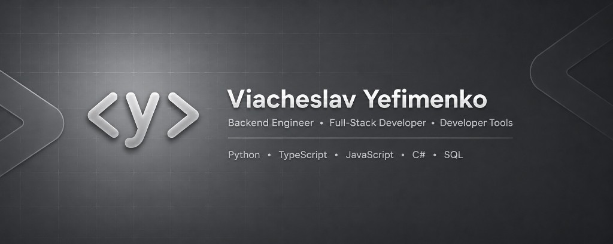

 

---

### About

Computer Science student focused on **backend engineering**, **full-stack applications** and **developer tools**.

> Open to Software Engineering internships and graduate opportunities.

---

### Languages

### Backend

### Database

### Frontend

### Tools

---

### Education

---

### Certifications

---
